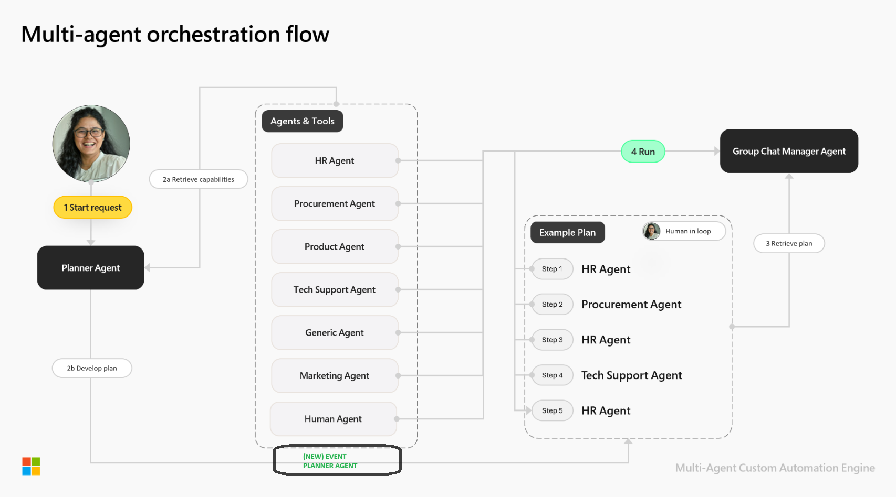
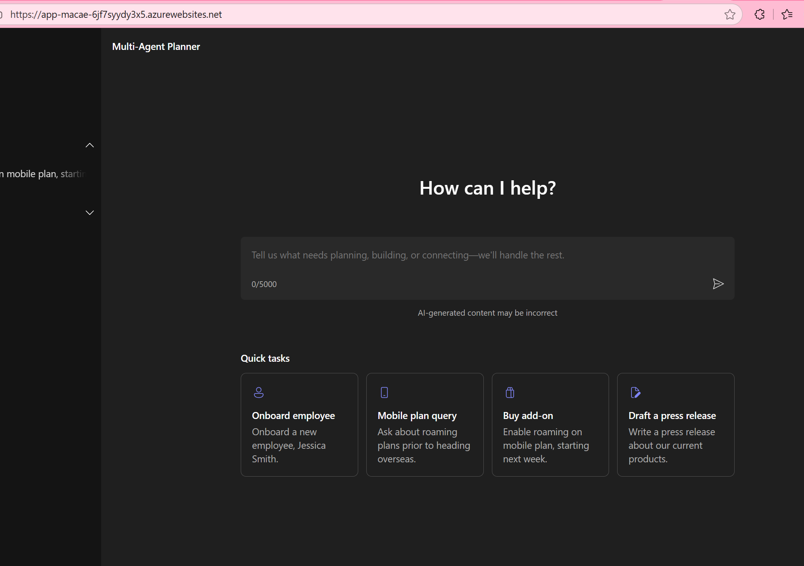
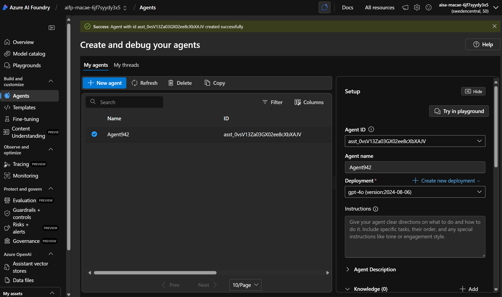
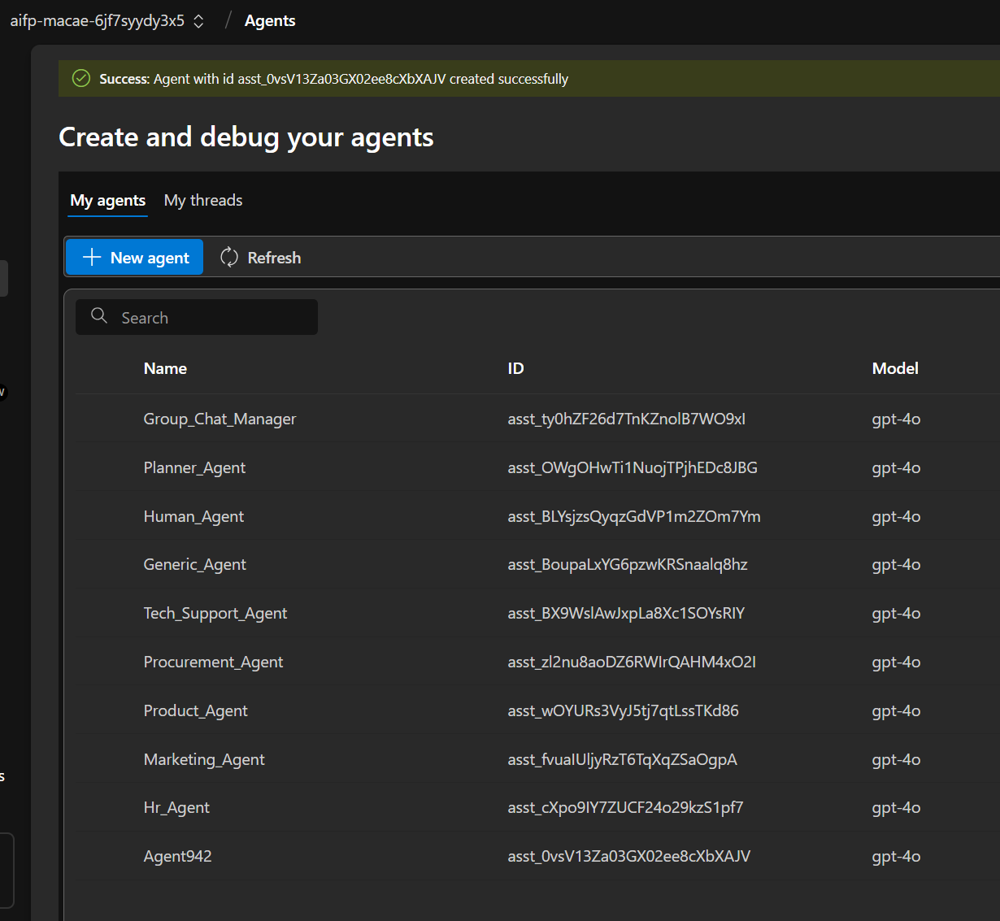
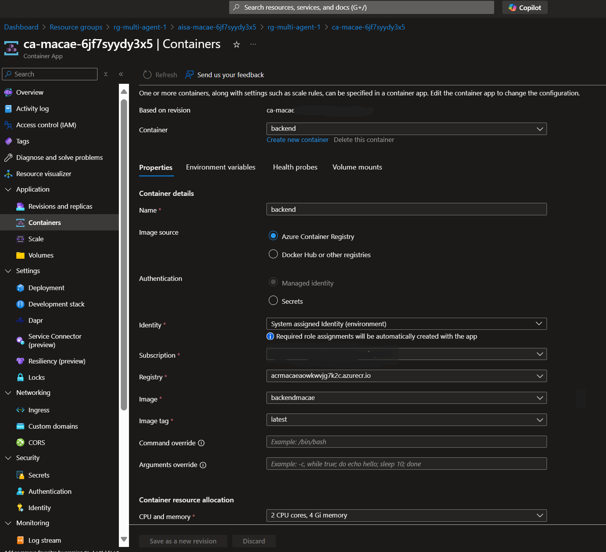
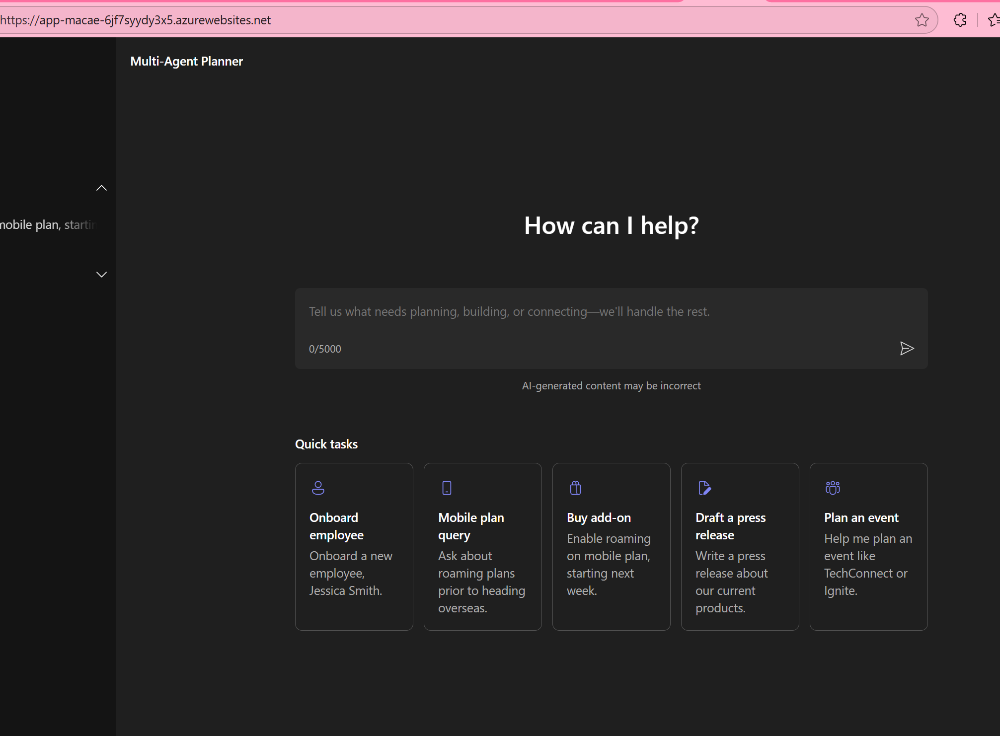
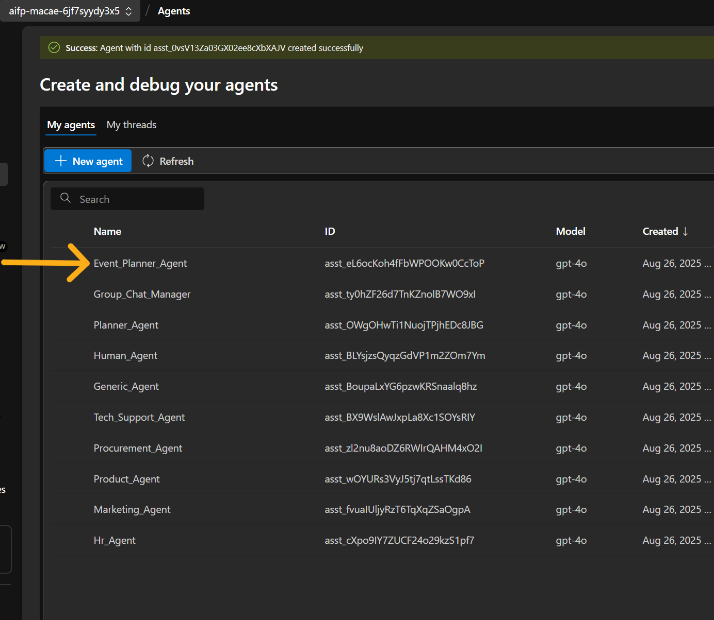

# Adding Your Own Agents to the Multi-Agent Solution Accelerator

Hi there, this GitHub repo builds off of this repo: https://github.com/microsoft/Multi-Agent-Custom-Automation-Engine-Solution-Accelerator directly with the following changes: 

1. A new customized agent added (by extending the codebase).
2. Response formatting handle dmore efficiently
3. Chat timeout increased
4. MAX_TOKENS increased
5. Leveraging GPT5 instead of GPT4-o.

Please refer to the original repo if you are interested in only deploying an out of the box solution and provision a ready made environment (although we will do these in this repo as well with the instructions below). 

<br/>

<div align="center">
  
[**SOLUTION OVERVIEW**](#solution-overview) \| [**QUICK DEPLOY**](#quick-deploy) \| [**BUSINESS SCENARIO**](#business-scenario) \| [**CODE CHANGES**](#code-changes)| [**SUPPORTING DOCUMENTATION**](#supporting-documentation)

</div>
<br/>

<h2>
Solution overview
</h2>

The solution leverages Azure OpenAI Service, Azure Container Apps, Azure Cosmos DB, and Azure Container Registry to create an intelligent automation pipeline. It uses a multi-agent approach where specialized AI agents work together to plan, execute, and validate tasks based on user input.

### Solution architecture
||
|---|

### Agentic architecture
||
|---|

<br/>

### Additional resources

[Semantic Kernel Documentation](https://learn.microsoft.com/en-us/semantic-kernel/)

[Azure AI Foundry Documentation](https://learn.microsoft.com/en-us/azure/ai-foundry/)

[Azure Container App documentation](https://learn.microsoft.com/en-us/azure/azure-functions/functions-how-to-custom-container?tabs=core-tools%2Cacr%2Cazure-cli2%2Cazure-cli&pivots=container-apps)

<br/>

### Key features
<details open>
  <summary>Click to learn more about the key features this solution enables</summary>

  - **Allows people to focus on what matters** <br/>
  By doing the heavy lifting involved with coordinating activities across an organization, people's time is freed up to focus on their specializations.
  
  - **Enabling GenAI to scale** <br/>
  By not needing to build one application after another, organizations are able to reduce the friction of adopting GenAI across their entire organization. One capability can unlock almost unlimited use cases.

  - **Applicable to most industries** <br/>
  These are common challenges that most organizations face, across most industries.

  - **Efficient task automation** <br/>
  Streamlining the process of analyzing, planning, and executing complex tasks reduces time and effort required to complete organizational processes.

</details>

<br /><br />
<h2>
Quick deploy
</h2>

### How to install or deploy
Follow the quick deploy steps on the deployment guide to deploy this solution to your own Azure subscription. YOU MUST DO THIS STEP IN ORDER TO PROVISION THE ENVIRONMENT FIRST. 

[Click here to launch the deployment guide](./docs/DeploymentGuide.md)

NOTE: Usually all you need to do is: from an Azure CLI terminal, run: ```az login```, choose the correct subscription and finish login. Then run ```azd up```
<br/><br/>

| [](https://codespaces.new/microsoft/Multi-Agent-Custom-Automation-Engine-Solution-Accelerator) | [](https://vscode.dev/redirect?url=vscode://ms-vscode-remote.remote-containers/cloneInVolume?url=https://github.com/microsoft/Multi-Agent-Custom-Automation-Engine-Solution-Accelerator) |
|---|---|
 
<br/>

> ⚠️ **Important: Check Azure OpenAI Quota Availability**
 <br/>To ensure sufficient quota is available in your subscription, please follow [quota check instructions guide](./docs/quota_check.md) before you deploy the solution.

<br/>
After you are done provisioning the new environment (takes about 10 mins), you should be able to go to the Azure Portal (https://portal.azure.com), go to the App Service deployed and click 'Browse'. This should open up a window like the image below. 

NOTE: When you first auto-provision the environment, it only deploys the base from this repo: https://github.com/microsoft/Multi-Agent-Custom-Automation-Engine-Solution-Accelerator which means no custom agents yet. 

STOP!! Before you start playing with the application, go to the AI Foundry service (also automatically deployed for you), open the service in AI Foundry portal (https://ai.azure.com) and then click on 'Agents' tab. It should have created a base agent for you.  

<p align="center">

</p>
<br/>

<p align="center">

</p>

Next, play with the application. Click on the badges to perform tasks with multi agents and see how they are created in Azure AI Foundry: 
<p align="center">

</p>

Your base application is working. 

Now, we will deploy custom agents and the new UI associated with it. 
Step 0. Create an Azure Container Registry (ACR) in the resource group you are using. You can do it manually (https://learn.microsoft.com/en-us/azure/container-registry/container-registry-get-started-portal?tabs=azure-cli) in the Azure Portal or via the command line (https://learn.microsoft.com/en-us/azure/container-registry/container-registry-get-started-azure-cli). NOTE: the auto-provision templates do not create an ACR automatically for you. 

Step 1. Go to your codebase, run  

```cd src/backend```
<br/>

Step 2. Login to ACR: 

```az acr login --name <acr-name>```


Step 3. Build and push your backend code to the ACR: 

```az acr build --registry <acr-name> --resource-group  <rg-name> --image backendmacae:latest . ```

Step 4. Repeat the above steps but for the frontend code. You may need to log into ACR again: 

```cd src/frontend```
<br/>

```az acr login --name <acr-name>```
<br/>

```az acr build --registry <acr-name> --resource-group <rg-name> --image frontendmacae:latest .```
<br/>

Step 5. Go to the container and update revision to point to new backend image: 
<p align="center">

</p>

Step 6. Update frontend website (assuming your frontend image is called 'frontendmacae:latest')

```az webapp config container set --resource-group <rg-name> --name <frontend-web-app-name> --container-image-name <container-name>.azurecr.io/frontendmacae:latest  --container-registry-url https://<acr-name>.azurecr.io```
<br/>

Step 7. Restart your Azure App Service in the Azure Portal and then click 'Browse' again. 

You should now see the new blade for 'planning an event'. If you click on it, the workflow will walk through the new agent code we added (see details below in [**CODE CHANGES**](#code-changes)). 

<p align="center">

</p>
<br/>
<p align="center">

</p>
<br/>

>⚠️ **Important:** To avoid unnecessary costs, remember to take down your app if it's no longer in use,
either by deleting the resource group in the Portal or running `azd down`.

<br /><br />
<h2>
Business Scenario
</h2>

||

|---|

<br/>

Companies maintaining and modernizing their business processes often face challenges in coordinating complex tasks across multiple departments. They may have various processes that need to be automated and coordinated efficiently. Some of the challenges they face include:

- Difficulty coordinating activities across different departments
- Time-consuming process to manually manage complex workflows
- High risk of errors from manual coordination, which can lead to process inefficiencies
- Lack of available resources to handle increasing automation demands

By using the *Multi-Agent Custom Automation Engine* solution accelerator, users can automate these processes, ensuring that all tasks are accurately coordinated and executed efficiently.

### Business value
<details>
  <summary>Click to learn more about what value this solution provides</summary>

  - **Process Efficiency** <br/>
  Automate the coordination of complex tasks, significantly reducing processing time and effort.

  - **Error Reduction** <br/>
  Multi-agent validation ensures accurate task execution and maintains process integrity.

  - **Resource Optimization** <br/>
  Better utilization of human resources by focusing on specialized tasks.

  - **Cost Efficiency** <br/>
  Reduces manual coordination efforts and improves overall process efficiency.

  - **Scalability** <br/>
  Enables organizations to handle increasing automation demands without proportional resource increases.

</details>

<br /><br />
<h2>
Code Changes
</h2>

### Frontend code changes: 
1. In the file: ./src/frontend/src/models/homeInput.tsx, add a new blade for your new agent (Event Planner in our case): 
    {
        id: "event",
        title: "Plan an event",
        description: "Help me plan an event like TechConnect or Ignite.",
        icon: <PeopleTeam20Regular />,
    }

   Add the import for PeopleTeam20Regular icon as well.

2. In the enums.tsx file, add the ```EVENT_PLANNER = "Event_Planner_Agent"``` in your AgentType enum.

### Backend code changes: 

<br /><br />

<h2>
Supporting documentation
</h2>

### Security guidelines

This template uses Azure Key Vault to store all connections to communicate between resources.

This template also uses [Managed Identity](https://learn.microsoft.com/entra/identity/managed-identities-azure-resources/overview) for local development and deployment.

To ensure continued best practices in your own repository, we recommend that anyone creating solutions based on our templates ensure that the [Github secret scanning](https://docs.github.com/code-security/secret-scanning/about-secret-scanning) setting is enabled.

You may want to consider additional security measures, such as:

* Enabling Microsoft Defender for Cloud to [secure your Azure resources](https://learn.microsoft.com/en-us/azure/defender-for-cloud/).
* Protecting the Azure Container Apps instance with a [firewall](https://learn.microsoft.com/azure/container-apps/waf-app-gateway) and/or [Virtual Network](https://learn.microsoft.com/azure/container-apps/networking?tabs=workload-profiles-env%2Cazure-cli).

<br/>

### Cross references
Check out similar solution accelerators

| Solution Accelerator | Description |
|---|---|
| [Document Knowledge Mining](https://github.com/microsoft/Document-Knowledge-Mining-Solution-Accelerator) | Extract structured information from unstructured documents using AI |
| [Modernize your Code](https://github.com/microsoft/Modernize-your-Code-Solution-Accelerator) | Automate the translation of SQL queries between different dialects |
| [Conversation Knowledge Mining](https://github.com/microsoft/Conversation-Knowledge-Mining-Solution-Accelerator) | Enable organizations to derive insights from volumes of conversational data using generative AI |

<br/>   

## Provide feedback

Have questions, find a bug, or want to request a feature? [Submit a new issue](https://github.com/jsinnovco/custom-multi-agent/issues) on this repo and we'll connect.

<br/>

## Responsible AI Transparency FAQ 
Please refer to [Transparency FAQ](./docs/TRANSPARENCY_FAQ.md) for responsible AI transparency details of this solution accelerator.

<br/>

## Disclaimers

To the extent that the Software includes components or code used in or derived from Microsoft products or services, including without limitation Microsoft Azure Services (collectively, "Microsoft Products and Services"), you must also comply with the Product Terms applicable to such Microsoft Products and Services. You acknowledge and agree that the license governing the Software does not grant you a license or other right to use Microsoft Products and Services. Nothing in the license or this ReadMe file will serve to supersede, amend, terminate or modify any terms in the Product Terms for any Microsoft Products and Services. 

You must also comply with all domestic and international export laws and regulations that apply to the Software, which include restrictions on destinations, end users, and end use. For further information on export restrictions, visit https://aka.ms/exporting. 

You acknowledge that the Software and Microsoft Products and Services (1) are not designed, intended or made available as a medical device(s), and (2) are not designed or intended to be a substitute for professional medical advice, diagnosis, treatment, or judgment and should not be used to replace or as a substitute for professional medical advice, diagnosis, treatment, or judgment. Customer is solely responsible for displaying and/or obtaining appropriate consents, warnings, disclaimers, and acknowledgements to end users of Customer's implementation of the Online Services. 

You acknowledge the Software is not subject to SOC 1 and SOC 2 compliance audits. No Microsoft technology, nor any of its component technologies, including the Software, is intended or made available as a substitute for the professional advice, opinion, or judgment of a certified financial services professional. Do not use the Software to replace, substitute, or provide professional financial advice or judgment.  

BY ACCESSING OR USING THE SOFTWARE, YOU ACKNOWLEDGE THAT THE SOFTWARE IS NOT DESIGNED OR INTENDED TO SUPPORT ANY USE IN WHICH A SERVICE INTERRUPTION, DEFECT, ERROR, OR OTHER FAILURE OF THE SOFTWARE COULD RESULT IN THE DEATH OR SERIOUS BODILY INJURY OF ANY PERSON OR IN PHYSICAL OR ENVIRONMENTAL DAMAGE (COLLECTIVELY, "HIGH-RISK USE"), AND THAT YOU WILL ENSURE THAT, IN THE EVENT OF ANY INTERRUPTION, DEFECT, ERROR, OR OTHER FAILURE OF THE SOFTWARE, THE SAFETY OF PEOPLE, PROPERTY, AND THE ENVIRONMENT ARE NOT REDUCED BELOW A LEVEL THAT IS REASONABLY, APPROPRIATE, AND LEGAL, WHETHER IN GENERAL OR IN A SPECIFIC INDUSTRY. BY ACCESSING THE SOFTWARE, YOU FURTHER ACKNOWLEDGE THAT YOUR HIGH-RISK USE OF THE SOFTWARE IS AT YOUR OWN RISK. 
